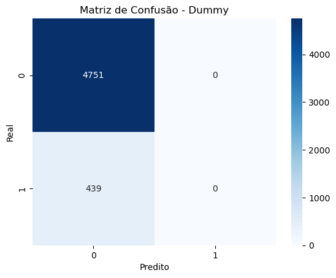
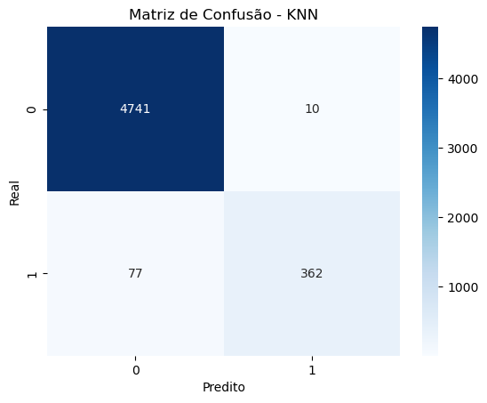
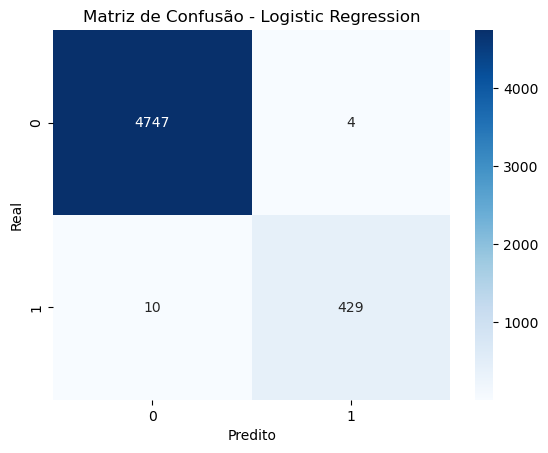
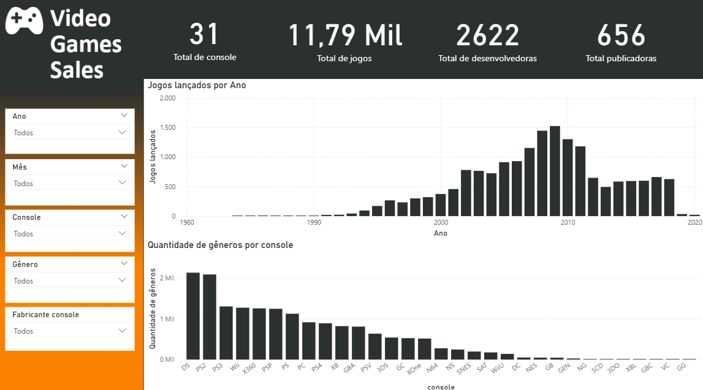
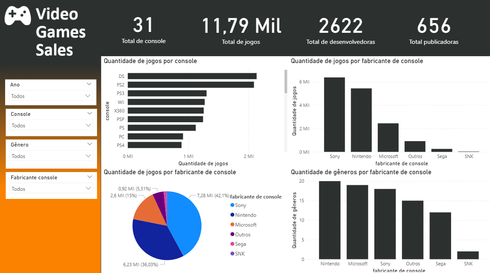
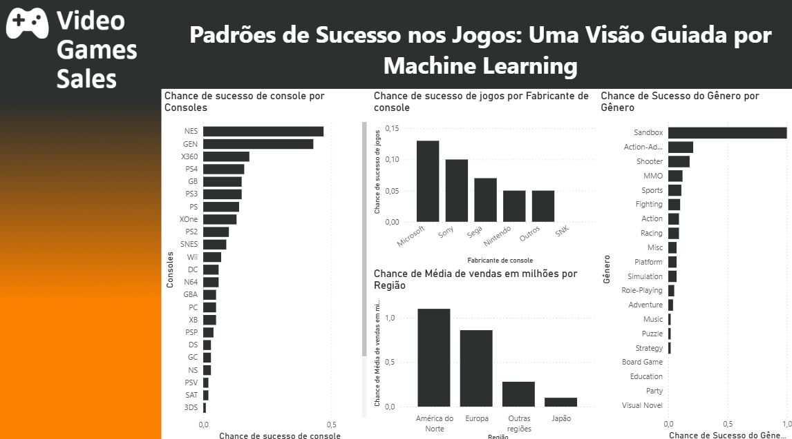

# Previsão de Sucesso de Jogos com Machine Learning

Este projeto tem como objetivo aplicar técnicas de Machine Learning para prever se um jogo será um sucesso com base em atributos como plataforma, gênero, ano de lançamento e outros. O processo foi dividido em três notebooks principais, análise dos dados e visualização com Power BI.

## Fonte dos Dados

Os dados utilizados neste projeto estão disponíveis em:  
[Kaggle - Video Game Sales](https://www.kaggle.com/datasets/gregorut/videogamesales)

**Sobre o dataset:**  
Este conjunto contém jogos com vendas acima de 100.000 cópias, extraídos do site vgchartz.com. Os campos disponíveis são:

- Rank (Ranking de vendas)
- Name (Nome do jogo)
- Platform (Plataforma)
- Year (Ano de lançamento)
- Genre (Gênero)
- Publisher (Publicadora)
- NA_Sales (Vendas América do Norte)
- EU_Sales (Vendas Europa)
- JP_Sales (Vendas Japão)
- Other_Sales (Outras regiões)
- Global_Sales (Vendas globais)

## Estrutura do Projeto

```
├── Notebooks
│   ├── 01_preprocessamento_vg_sales.ipynb
│   ├── 02_modelagem_vg_sales_success.ipynb
│   └── 03_insights_vg_sales_success.ipynb
├── Dados tratados
│   ├── video_game_sales_com_target.csv
│   ├── analise_genero_sucesso_acuracia.csv
│   ├── tabela_calendario.csv
│   ├── analise_console_sucesso_acuracia.csv
│   ├── analise_fabricante_previsao_acuracia.csv
│   └── analise_regiao_sucesso.csv
├── Power BI
│   └── Análise de Vendas de Jogos.pbix
├── Prints
│   ├── matriz_dummy.png
│   ├── matriz_knn.png
│   ├── matriz_random_forest.png
│   ├── matriz_logistic_regression.png
│   ├── Dashboard_01.png
│   ├── Dashboard_02.png
│   └── Dashboard_03.png
└── README.md
```

## 1. Pré-processamento (`01_preprocessamento_vg_sales.ipynb`)

Neste notebook, foram realizadas as seguintes etapas:

- Limpeza e tratamento dos dados originais.
- Criação de variáveis categóricas ajustadas (como fabricante do console).
- Criação de coluna target `Sucesso`, baseada em percentis de vendas globais.
- Exportação do dataset tratado.

## 2. Modelagem (`02_modelagem_vg_sales_success.ipynb`)

Aqui foram aplicados os seguintes modelos de classificação:

- Dummy Classifier
- K-Nearest Neighbors (KNN)
- Random Forest
- Regressão Logística

Todos os modelos foram treinados em um pipeline com tratamento de variáveis numéricas e categóricas, além de validação cruzada.

### Matriz de Confusão dos Modelos

**Dummy Classifier**  


**KNN**  


**Random Forest**  


**Logistic Regression**  


## 3. Geração de Insights (`03_insights_vg_sales_success.ipynb`)

Foram realizadas análises para responder às seguintes perguntas:

- Quais gêneros têm maior chance de sucesso?
- Quais consoles possuem maior taxa de acerto do modelo?
- Como os fabricantes se comportam em relação às previsões de sucesso?
- Qual a distribuição geográfica dos jogos bem-sucedidos?

Os dados gerados foram exportados para uso no Power BI.

## Análise Geral da Acurácia

Todos os modelos previram melhor que o classificador aleatório (Dummy). O modelo de Regressão Logística e Random Forest apresentaram melhor equilíbrio entre sensibilidade e especificidade.

## Dashboard (`Power BI/Dashboard.pbix`)

Foi desenvolvido um painel interativo com as seguintes visões:

- Gêneros mais bem-sucedidos por região.
- Plataformas com maior concentração de jogos bem-sucedidos.
- Desempenho por fabricante.
- Evolução anual do sucesso de jogos.

### Prints do Dashboard

  

