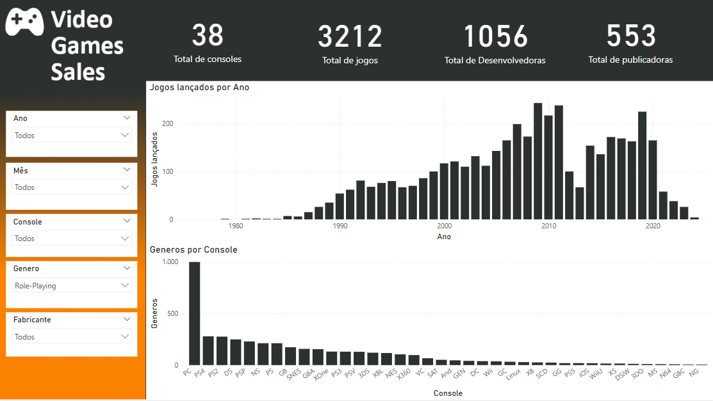
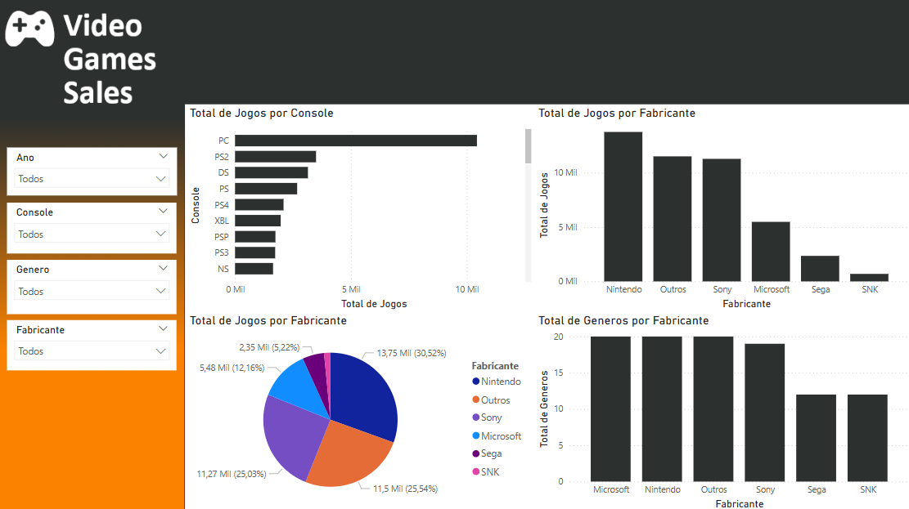

# Análise de Vendas de Video Games

Este projeto tem como objetivo explorar e analisar dados de vendas de jogos eletrônicos com o intuito de extrair insights do mercado e compreender tendências de lançamentos por console, gênero, desenvolvedora, publicadora e fabricante. O trabalho combina **pré-processamento e transformação dos dados** (usando Python com Pandas) e a criação de dashboards interativos no **Power BI**.

---

## 📁 Sobre o Projeto

O projeto é dividido em duas partes principais:

1. **Preparação e Tratamento dos Dados:**  
   Os dados foram obtidos através da plataforma [Maven Analytics](https://www.mavenanalytics.io/) e passaram por um processo de limpeza e transformação. [Link para download direto](https://maven-datasets.s3.amazonaws.com/Video+Game+Sales/Video+Game+Sales.zip) .
   - Foram selecionadas as colunas relevantes: `title`, `console`, `genre`, `publisher`, `developer`, `release_date`.
   - A coluna `release_date` foi convertida para o tipo `datetime` e, a partir dela, foi extraída a coluna `ano`.
   - 17 registros nulos na coluna `developer` foram substituídos por `"Não informado"`.
   - 6648 registros com datas ausentes foram removidos (na coluna `release_date`, e consequentemente na coluna `ano`).
   - Foi feita uma filtragem para manter somente os consoles mais representativos, baseados em uma lista pré-definida (`consoles_validos`).
   - Criada a coluna `fabricante` para agrupar os consoles por empresa (por exemplo, todos os consoles da linha Playstation foram agrupados como "Sony", os do Xbox como "Microsoft", entre outros).
   - Por fim, uma tabela calendário foi construída (com frequência diária) para enriquecer as análises temporais no Power BI, permitindo a extração de colunas derivadas como ano, mês, trimestre, dia da semana etc.

2. **Desenvolvimento dos Dashboards no Power BI:**  
   Foram criados dois dashboards com o intuito de explorar diferentes aspectos dos dados:
   - **Dashboard 1: Video Game Market Insights**  
     *Funcionalidades e Visualizações:*  
     - Exibição de KPIs de vendas globais (total de vendas, títulos únicos, desenvolvedoras, publicadoras, consoles etc.).
     - Gráficos de barras mostrando a evolução dos lançamentos ao longo do tempo.
     - Filtros dinâmicos para segmentação por mês, ano, console, gênero e desenvolvedora.

     

   - **Dashboard 2: Visão Geral: Jogos, Fabricantes e Consoles**  
     *Funcionalidades e Visualizações:*  
     - Gráficos comparativos (barras, pizza) detalhando a distribuição de títulos por console e fabricante.
     - Análises de diversidade de gêneros por fabricante.
     - Visualizações que permitem identificar as plataformas com maior volume de lançamentos e os fabricantes mais ativos.
     - Segmentações que possibilitam cruzar variáveis como ano, console, gênero e fabricante.

     

---

## 🛠️ Tecnologias Utilizadas

- **Linguagens e Bibliotecas:**  
  - Python e Pandas  
  - Jupyter Notebook para análise e transformação dos dados

- **Ferramentas de Visualização:**  
  - Power BI para desenvolvimento dos dashboards